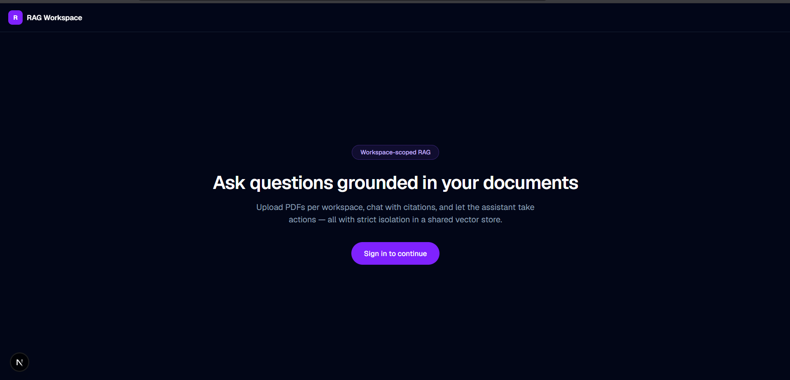

## Demo video

[](https://youtu.be/FKsy_HLeTaw)


This project has two parts:

- Client: a Next.js frontend
- Server: an Express backend with background worker for PDF ingestion and RAG indexing

## Prerequisites

Make sure you have the following installed:

- Node.js 18+ or 20+
- pnpm
- Docker Desktop

## 1. Start the local infrastructure

From the project root:

```bash
docker compose up -d valkey qdrant
```

This starts:

- Valkey/Redis on port 6379
- Qdrant on port 6333

## 2. Server setup

```bash
cd server
pnpm install
```

Make sure the server environment file exists at [server/.env](server/.env) and contains the required keys such as:

- GOOGLE_API_KEY
- CLERK_SECRET_KEY
- CLERK_PUBLISHABLE_KEY
- DATABASE_URL (if your setup uses one)

Start the API server:

```bash
pnpm run dev
```

In a second terminal, start the worker:

```bash
cd server
pnpm run worker
```

The backend will be available at:

- http://localhost:8000
- Health check: http://localhost:8000/health

## 3. Client setup

```bash
cd client
pnpm install
pnpm dev
```

The frontend will be available at:

- http://localhost:3000


## Notes

- AI_NOTES.md
- design.md