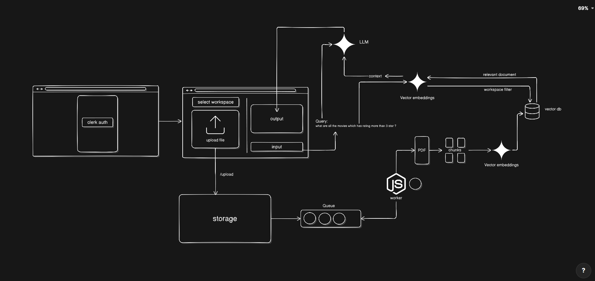
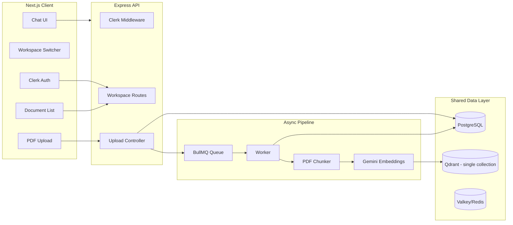

# How i was Thinking

### This is not the actual design document, but a set of notes and diagrams that capture the design decisions made during implementation. this shows how started with design thinking and evolved into the final architecture.

- How i started: I started with a simple design thinking approach,


## Overview

This project is a workspace-scoped RAG assistant for PDF documents.

- Client: Next.js frontend
- Server: Express backend
- Authentication: Clerk
- Metadata storage: PostgreSQL
- Queues/cache: BullMQ + Valkey
- Vector search: Qdrant
- Embeddings: Gemini

## Core Design Decisions

- Documents are stored in PostgreSQL for metadata and document lifecycle state.
- Chunks are embedded and stored in Qdrant with workspace-level metadata for retrieval isolation.
- Retrieval is scoped by workspace at query time so one workspace cannot pull documents from another.
- Uploads are processed asynchronously through BullMQ so the API stays responsive.

## Strategy Choice

- Chunking strategy: overlapping text chunks with a moderate size so each chunk keeps local context without becoming too noisy.(model: gemini-embedding-001 , vector size: 1536, PDF OCR: tesseract, PDF file 1-6pages)
- Retrieval strategy: semantic similarity search with an additional workspace filter so results stay isolated per workspace.
- Why this choice: it balances accuracy and cost while keeping the answer grounded in the user’s own documents.
- Model role: the embedding model converts text to vectors for indexing and query matching, while the chat model uses the retrieved chunks to generate the final answer.

## Chunk Storage Structure

Each chunk is stored with its text content and metadata so retrieval can filter correctly.

```json
{
  "content": "TEXT BOOKS RECOMMENDED:- 1. Senior J.M., Optical F…",
  "metadata": {
    "source": "uploads\\1783125257138-749963107-syllabus-1-6.pdf",
    "pdf": {},
    "loc": {},
    "workspaceId": "11107a34-7b05-4e36-abaf-187c2299ff21",
    "documentId": "07dc3816-2e93-4431-abbc-98b2c8c569c5",
    "filename": "syllabus-1-6.pdf",
    "chunkIndex": 3
  }
}
```

## RAG Flow

1. Upload a PDF.
2. Parse and split the document into overlapping chunks.
3. Generate embeddings for each chunk.
4. Store the chunk text and metadata in the vector store.
5. When a user asks a question, embed the query and retrieve only relevant chunks from the same workspace.
6. Build the prompt from those chunks and return the answer with citations.

## Expected Data Model

- Workspaces
  - id
  - user_id
  - name
- Documents
  - id
  - workspace_id
  - filename
  - storage_path
  - status
  - chunk_count
- Conversations / messages / tool calls
  - used for chat history and tool execution logging


## Target Architecture


